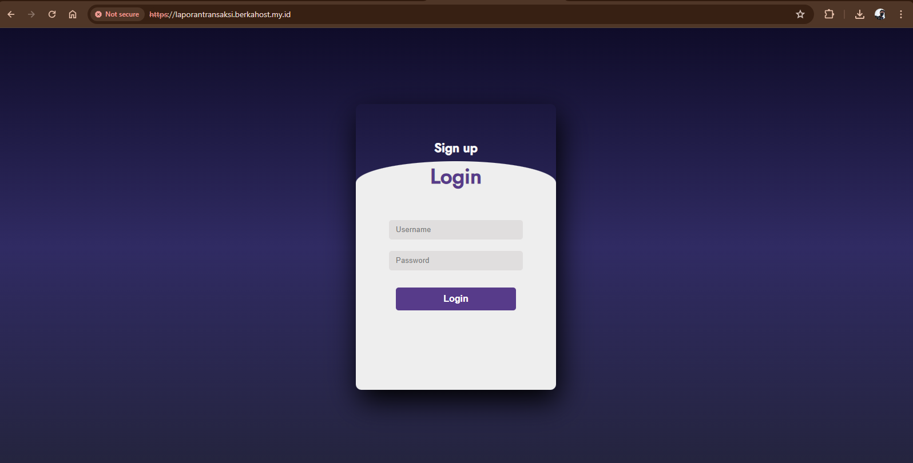
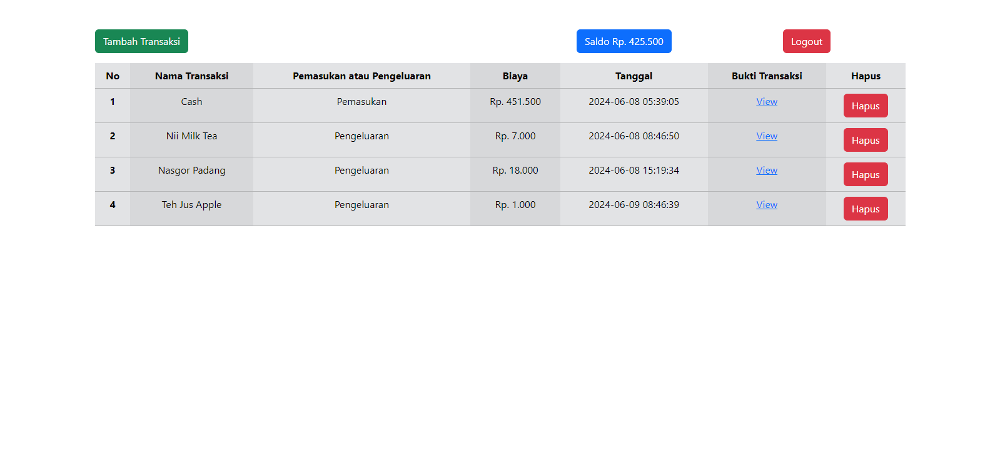

<p align="center"></p>

<h1 align="center">
   <a href="https://themeselection.com/item/sneat-free-bootstrap-html-laravel-admin-template/" target="_blank" align="center">
      Laporan Transaksi Keuangan
   </a>
</h1>

<p align="center">Menggunakan Bootstrap 5 sebagai Frontend Dan Laravel 11 sebagai Backend</p>




## Introduction 🚀

Selamat datang di LaporanTransaksi Apps, platform laporan keuangan pribadi yang dirancang untuk memberikan kontrol penuh atas keuangan Anda. Dengan antarmuka yang intuitif dan didukung oleh teknologi Bootstrap 5 dan Laravel 11, FinanceFlow memudahkan pengguna untuk melacak Pemasukan dan Pengeluaran sehari-hari dengan efisien.

Di LaporanTransaksi Apps, kami memahami pentingnya mengelola keuangan dengan cara yang terstruktur dan mudah diakses.

## Installation ⚒️

Installing and running Sneat is super easy, please Follow below steps and you will be ready to rock 🤘

1. Open the terminal in your root directory.

2. Clone Project

```bash
git clone https://github.com/RegaAnton/Laporan_Transaksi_Keuangan.git
```

3. Use the following command to install the composer

```bash
composer install
```

4. Copy .env.example ke .env

```bash
cp .env.example .env
```

5. Run the following command to generate the key

```bash
php artisan key:generate
```

5. Open the env file to change the database according to the one you are using

```bash
DB_CONNECTION=mysql
DB_HOST=127.0.0.1
DB_PORT=3306
DB_DATABASE=app_transaction_report
DB_USERNAME=root
DB_PASSWORD=
```

6. Create Database

```bash
php artisan migrate:fresh
```

7. Start Project

```bash
php artisan serve
```
